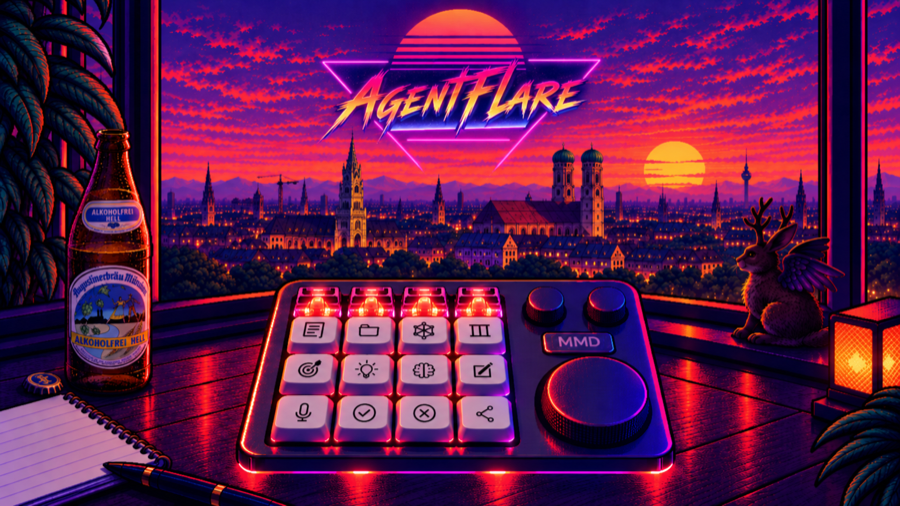
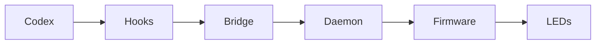

# AgentFlare

<p align="center">
  
</p>

AgentFlare turns an MMD KM16 Pro macro pad into a small visual status display
for Codex and other coding agents.

I bought the KM16 Pro as a local alternative to Codex Micro. Its hardware can
control LEDs individually, but the stock firmware does not expose that option.
The [RawMacroPad project](https://github.com/toptensoftware/rawMacroPad) was a
useful reference, but its approach does not support the KM16 Pro. This project
therefore takes a different path.

This repository explains how to create a small firmware patch from a verified
stock backup. The patch keeps the original device software usable while adding
individual LED control. It also includes the local bridge and daemon that turn
Codex hook events into lights on the pad. The same design can support other
coding tools later.

Everything runs locally. The bridge does not control your Codex task and does
not store prompt text, tool input, responses, or transcripts.

AgentFlare currently supports macOS, a KM16 Pro in USB mode with the documented
Direct-LED firmware, and Codex command hooks. Claude Code and OpenCode are
reserved for future integrations.

## How it works



Hooks are small notices from Codex. The bridge translates them, and the daemon
is the single local service that chooses the lights and talks to the keyboard.
“HID” is the USB protocol used to control the keyboard. “FIFO” means that extra
subagents wait in arrival order. “Active-session takeover” means the keyboard
follows the Codex task whose recognized hook activity was observed most
recently.

## What you see

| Observed event | Keyboard state | What it proves |
| --- | --- | --- |
| Main work starts or continues | White underglow | A hook reached the daemon and its desired state was accepted, not that LEDs have physically updated. |
| Codex requests user input | Blue underglow | A permission or input-required hook was observed. It does not represent ordinary tool waiting. |
| Up to four subagents run | First-row keys use stable accent colours | The daemon assigned visible slots. Additional subagents wait FIFO. |
| A `Stop` hook arrives | Mint green candidate for 1.5 seconds, then off | Codex reported a stop point. This is not authoritative success because a hook may request continuation. |
| An `Interrupt` hook arrives | Coral red for 1.5 seconds, then off | A main-turn interruption was observed. The current hook set does not produce a proven failure state. |
| Subagent stops | Its key is removed | Codex stop hooks do not provide a trustworthy terminal outcome. |
| Binding becomes stale | Reserved keys and underglow turn off | Observation is no longer reliable, not that the task failed. |

If the same turn continues after a `Stop` hook, the bridge replaces the short
green candidate with the renewed active state. It uses a new internal run
identity for that continuation, so the daemon's strict terminal validation
remains in force.

The current configuration uses global Codex registration, four visible
subagent slots, FIFO queueing, active-session takeover, 35% key brightness, and
25% underglow brightness. The daemon can confirm it received an update before
the physical keyboard has shown it, so physical LED behaviour needs a separate
check. The bridge calls a session active when it receives its latest recognized
hook activity. It does not observe the Codex window or prove foreground focus.

## Canonical setup

Run these commands in Terminal. The standard path below installs prerequisites,
clones the repository into `~/Developer/agentflare`, then starts AgentFlare.

1. **Install Apple’s command-line tools and Homebrew if needed.**

   ```bash
   xcode-select --install
   # Install Homebrew from https://brew.sh if `brew --version` fails.
   brew install uv
   # If Homebrew provides another release, install the exact standalone build:
   # curl -LsSf https://astral.sh/uv/0.8.22/install.sh | sh
   test "$(uv --version | awk '{print $2}')" = "0.8.22"
   ```

   Install **Go 1.27.1** from [go.dev/dl](https://go.dev/dl/), then open a new
   Terminal window and check:

   ```bash
   git --version
   uv --version
   uv python install 3.12
   go version
   ```

   Expected result: all version commands print a version. `scripts/setup.sh` will
   reject a Go version different from the version declared in `go.mod`.

2. **Clone or download the repository.** With Git, use:

   ```bash
   mkdir -p ~/Developer
   cd ~/Developer
   git clone https://github.com/konstantinrink/agentflare.git agentflare
   cd agentflare
   ```

   Expected result: `pwd` ends in `Developer/agentflare`. If you downloaded a
   ZIP instead, extract it, open Terminal in that extracted folder, and run
   `pwd` before continuing.

3. **Build the software.**

   ```bash
   scripts/setup.sh
   ```

   Expected result: macOS, Python and the Go version from `go.mod` are reported,
   followed by two binaries in `daemon/bin/`. This step does not access a
   keyboard, install a service, or change firmware.

4. **Satisfy the firmware prerequisite if the keyboard still runs stock firmware.**

   Read and complete the owner-operated [firmware guide](firmware/README.md)
   (~15 minutes on macOS, brick risk, second verified backup required).
   Expected result: a verified Direct-LED image and readback only if you
   explicitly choose to perform hardware work. Stop here if you do not have a
   verified recovery path.

5. **Start the daemon in the foreground.**

   ```bash
   ./daemon/bin/agentflare daemon
   ```

   Expected result: the daemon remains running in this terminal. Keep it open
   while completing the next steps.

6. **Install the global Codex hooks.** In a second Terminal window, return to
   the same repository and preview then install them.

   ```bash
   cd ~/Developer/agentflare
   uv run --locked --project integrations/codex python integrations/codex/install.py --mode global --preview
   uv run --locked --project integrations/codex python integrations/codex/install.py --mode global
   ```

   Expected result: the preview contains a shell-quoted local bridge path. The
   installation writes only AgentFlare-owned handlers, records their checksum,
   preserves unrelated hooks, and backs up an existing configuration only when
   it changes one.

7. **Open Codex and trust the hooks.** Review the hook configuration through
   Codex's normal trust flow. Start a small task, cause an approval or input
   request if appropriate, then let it complete. Expected result: see the
   lifecycle states in the table above. Check accepted daemon state with:

   ```bash
   ./daemon/bin/agentflare status --v2 --json
   ```

   This confirms service state only. Verify physical LEDs separately.

## Alternatives

Project-local hooks isolate one repository. Use this instead of global hooks,
not in addition to them, to avoid duplicate events:

```bash
uv run --locked --project integrations/codex python integrations/codex/install.py --mode project --project /path/to/project
```

Login autostart is optional. Stop the foreground daemon before enabling it, then
install the launchd job:

```bash
daemon/launchd/install.sh
```

The installer defaults to 35% key and 25% underglow brightness and accepts
`--key-brightness` and `--underglow-brightness` from 0 through 100.

## Focused troubleshooting

- **Setup helper rejects Go:** install the exact Go version printed from
  `go.mod`, then rerun `scripts/setup.sh`.
- **Daemon unavailable:** run it in the foreground first. For login autostart,
  inspect the job and logs using the [daemon guide](daemon/README.md).
- **No hook update:** confirm that Codex trusted the installed configuration and
  that only one of global or project-local registration is active.
- **Installation refuses to change a bridge or hook:** it found an unregistered
  or modified AgentFlare-like component. Preserve it and resolve ownership
  manually rather than overwriting it.
- **A hook reports an uncertain transaction:** keep the daemon available and
  recover the last durable display snapshot with
  `uv run --locked --project integrations/codex python integrations/codex/agentflare_bridge.py --recover --session-id '<session-id>'`.
  This creates a fresh binding and deliberately drops the event whose response
  was lost.
- **No physical colour:** normal tests do not probe HID. Verify USB mode and the
  firmware support boundary in the [firmware guide](firmware/README.md).

## Further reading

- [Daemon operation](daemon/README.md)
- [Codex hook integration](integrations/codex/README.md)
- [Firmware procedure](firmware/README.md)
- [Contributing](CONTRIBUTING.md)

## License

Original AgentFlare code is licensed under the [MIT License](LICENSE). Firmware
materials may have separate provenance and licence obligations.
